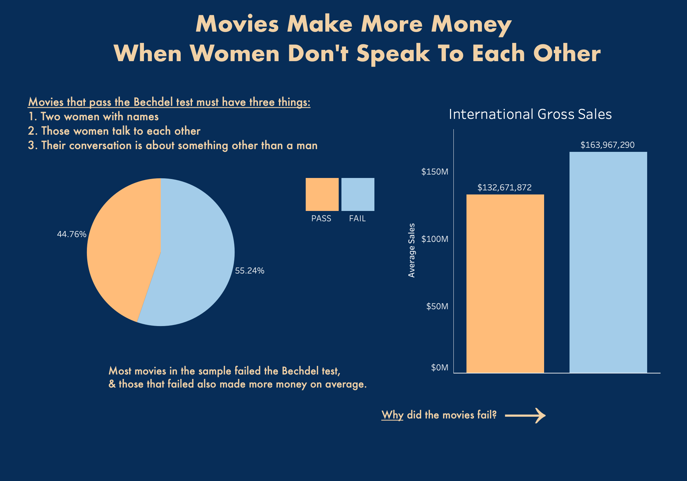
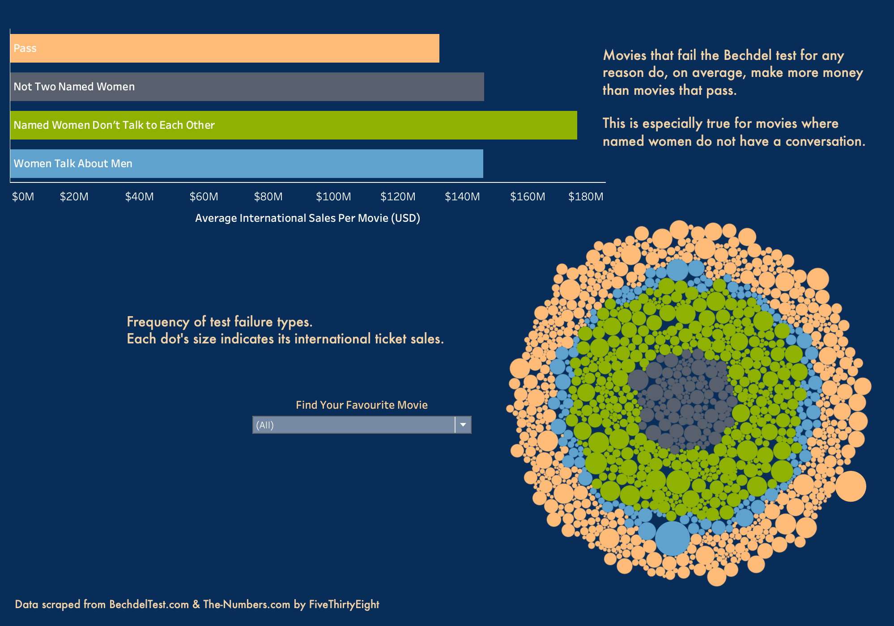
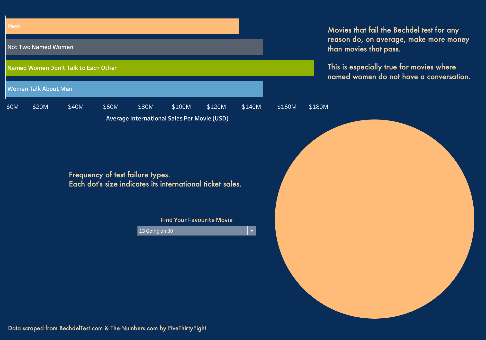

# Investigating Bechdel Test Failures
---

# Introduction
This project uses Tableau to investigate the various reasons that movies fail the Bechdel Test. The Bechdel Test is used to provide a quick and easy measure of the gender equality of movies. Because this is such a complex issue, the Bechdel Test only provides a starting point to evaluating films in this way. To pass the Bechdel Test, there must be two named women in the movie, those women must talk to each other, and their conversation has to be about something other than men. This is a surprisingly high bar for many movies released even today.

The dataset consists of nearly 2000 movies, their pass/fail status, and if they did fail, which requirement they did not fulfill. This data was scraped by [FiveThirtyEight](https://fivethirtyeight.com/) from [BechdelTest.com](https://bechdeltest.com/) and [The-Numbers.com](https://www.the-numbers.com/).

# Exploratory Analysis
In the sample of movies, 55% failed the test, and these movies also made more money on average ($132.6 million in gross international sales vs. $163.9 million).

# Further Analysis
After comparing movies on whether they passed or failed, I was interested in the reasons *why* certain movies failed the Bechdel Test. This led to the main analysis of this project, which compared the average international gross sales of each failure type (not two named women, the named women do not talk to each other, or those named women talk to each other, but about men). In the visualizations, it is clear that movies that failed for any reason had greater ticket sales than movies that passed the test. Specifically, movies where there were two named women who did not talk to each other had the highest average international gross sales of all categories.

Along with the graph showing average sales of each category you can see all of the data broken out by individual movie, and displaying their reason for failing (or if it passed), and the international gross earnings, represented by size. This visualization is also interactive, and allows the viewer to search a movie of their choice to see how it faired. For example, in the following image, I have selected the movie *13 Going on 30*, and, as you can see, it passes the Bechdel Test. For full interactivity, you can view this project on my [Tableau Public Page](https://public.tableau.com/app/profile/sara.kai.luker/viz/BechdelTestProject/BechdelTestProject).

# Conclusion
This result, in my opinion, indicates the presence of women characters included for appearances only, who do not add meaningfully to the plot. Even if women characters exist and have names, the majority of them are not having conversations with each other, yet audiences are still paying to see those movies. 