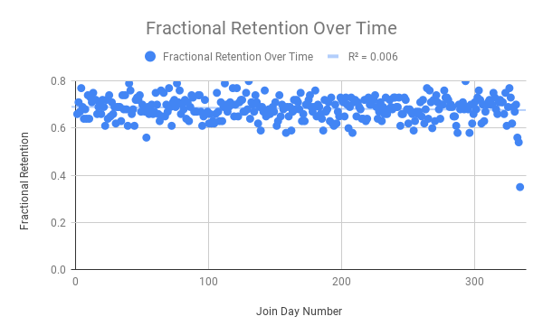
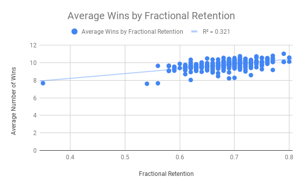
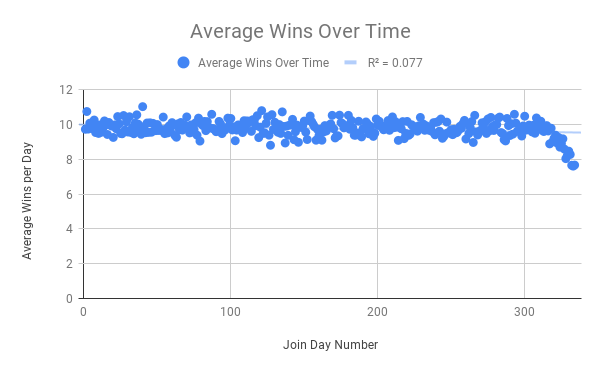

# Final Data Set:
https://docs.google.com/spreadsheets/d/1uySl7MKFal3Gqtz7Y3OneHGZJAqdRU5FH1FVa3dZzR0/edit?usp=sharing

# Project Explanation
In this project, we were tasked with finding the 30-day rolling retention of a mobile game’s players in order to report back to the company for its first anniversary. Along with retention rate, I chose to find the average win rate of players who joined on a certain day, and see if there is a relationship between the two. 

After exploring the data, I was interested in investigating the link between winning and retention, so decided to focus on that for our secondary inquiry. Using nested queries, I first found the day that each player joined, and the day of their most recent match, then used those to calculate whether that last match was more or fewer than 30 days from their join date. I then divided the total number of people who had played a match 30 or more days after they joined - those who had been retained - by the total number of people who joined the app on that day, to find the fractional retention. 

As well, I calculated the average wins per day of players, sorted by their join date, to visualize the relationship between retention and win ratio. Players who joined near the end of the cycle were unable to play a match more than 30 days after they had joined, and so were considered not to be retained automatically, therefore I decided to limit all analyses to only those players who joined more than 30 days before the end of the measurement period. 

As indicated by the visualizations provided, rolling retention was fairly stable through time, with around 68% of players being retained more than 30 days after joining. There is some drop off in retention at the tail end of the data’s time frame, however this can be explained by people who joined later in the cycle having fewer playing opportunities. This overall steady retention rate is a very positive indicator for the success of the mobile game company. 

To supplement this information, I found that retention rate is moderately related to players’ average daily win rate. This tells us that players who win less often are less likely to be retained in the long term. Though this relationship is not very strong, players who lose games more often could potentially be targeted for incentives to boost their retention rate. Players who may be given incentives could specifically include players new to the game, as they specifically have lower win rates. This could increase retention over the long term.

