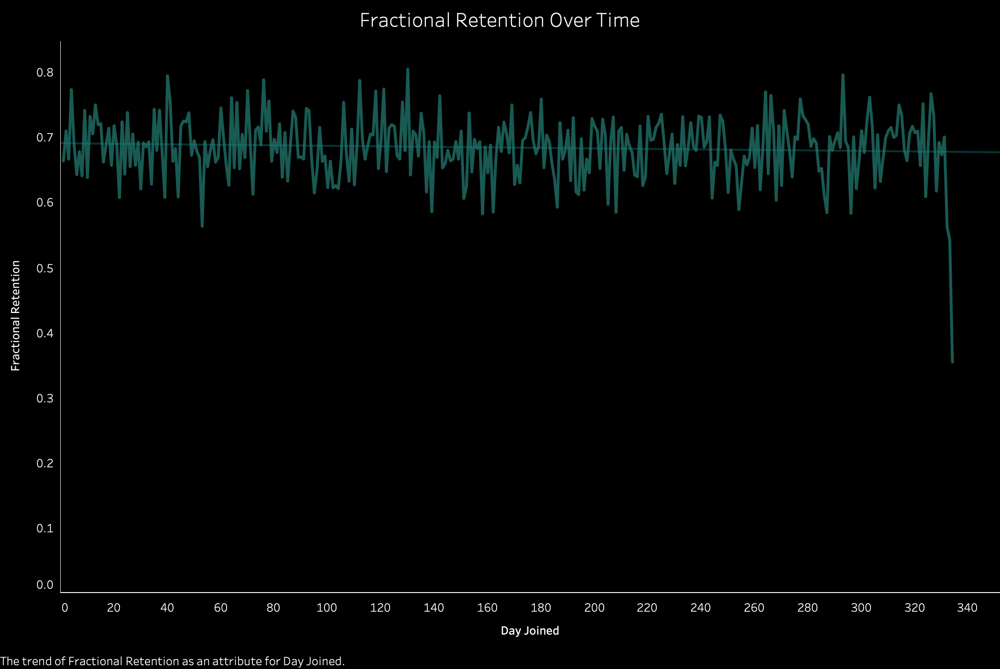
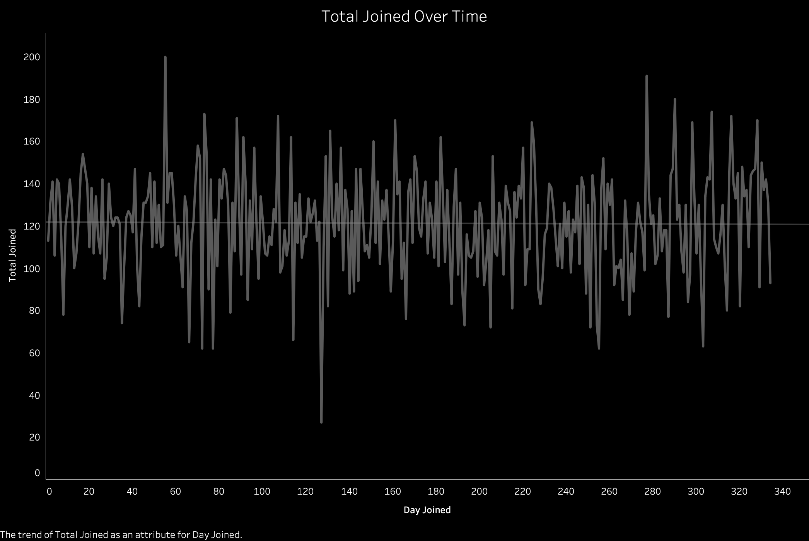
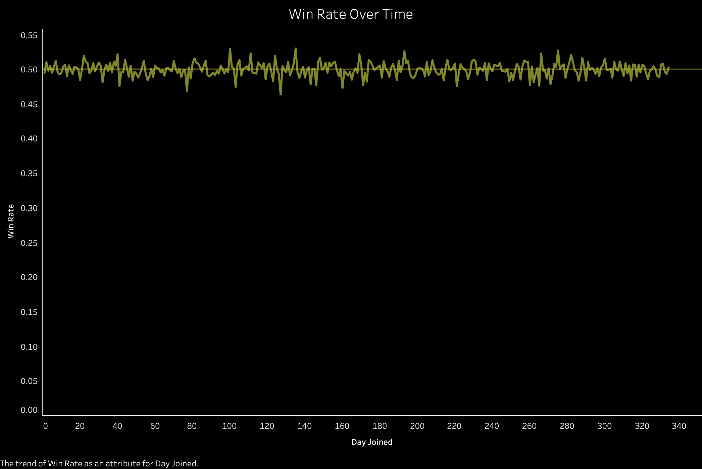
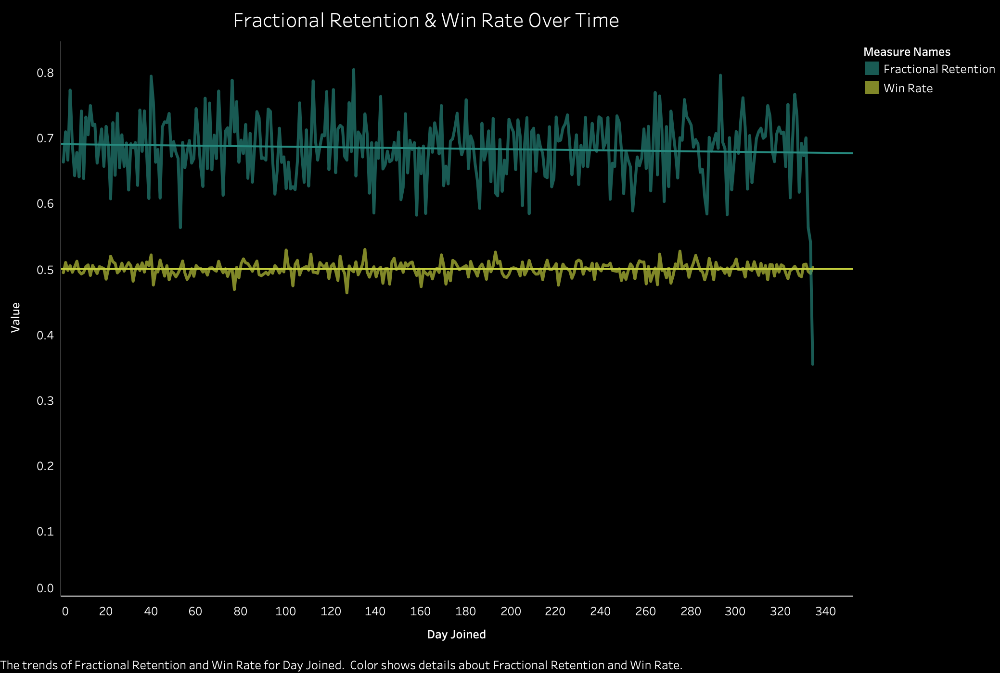
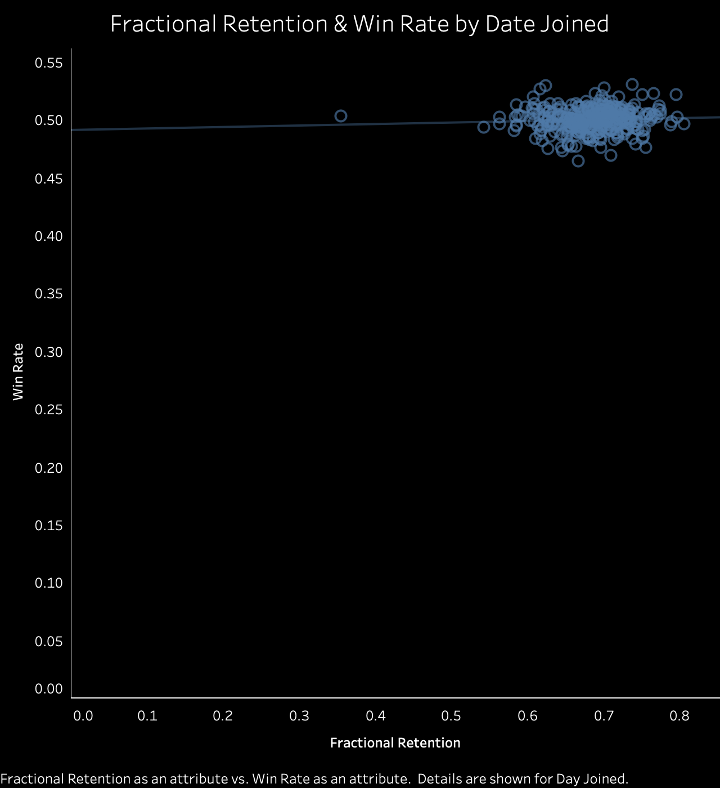

# Mobile Game Retention
---

# Introduction
In this project, we were tasked with finding the 30-day rolling retention of a fictional mobile game’s players in order to report back to the company for its first anniversary. Along with retention rate, I chose to find the proportion of winning matches by players who joined on the same day, to investigate a potential relationship between winning and retention. This was all done using SQL in Google BigQuery, with visualizations created in Tableau.

# SQL Query
## Step One
```sql
SELECT player_id,
        joined
FROM `graphic-tensor-329514.sql_project.player_info` AS player
    JOIN
SELECT player_id,
       MAX(day) AS last_match,
       SUM(CASE WHEN outcome = 'win' 
            THEN 1 
            ELSE 0 
            END) AS wins,
       COUNT(DISTINCT match_id) AS num_matches
FROM `graphic-tensor-329514.sql_project.matches_info`
GROUP BY player_id AS matches
    ON player.player_id = matches.player_id
```
In the query above, I first compiled all of the information I needed from the raw data to answer my questions, and joined the two tables. From the `player_info` table, this consisted of the `player_id` and `joined` columns. From the `matches_info` table, I selected the `player_id` column to use as a primary key when joining the two tables, then found the last day on which each player played a match with `MAX(day) AS last_match`. This will be used to find rolling retention, as retained players must have played a match more than 30 days after joining. As well, I found the total number of matches that each player won, with
```sql
SUM(CASE WHEN outcome = 'win' 
                THEN 1 
                ELSE 0 
                END) AS wins
```
I will need to know the number of matches each player has won to calculate the win rate later on.

## Step Two
```sql
SELECT joined AS day_joined,
       COUNT(DISTINCT player.player_id) AS total_joined,
       SUM(CASE
           WHEN matches.last_match - player.joined >30
           THEN 1
           ELSE 0
           END) AS retention,
       ROUND((SUM(CASE 
           WHEN matches.last_match - player.joined >30
           THEN 1
           ELSE 0
           END))/COUNT(DISTINCT player.player_id), 4) AS fractional_retention,
        ROUND((SUM(wins)/SUM(num_matches)), 4) AS win_rate
```
With `COUNT(DISTINCT player.player_id) AS total_joined` I find the number of players who joined on a specific day. Next, I am able to use the `SUM` function to count how many players were retained on that day, by assigning a 1 when `matches.last_match - player.joined >30` is true, and a 0 when it is false, and aggregating the data by players' join day. I perform this same function again, to find the `retention` value, however this time I divide it by the number of players that joined that day to find `fractional_retention`. Lastly, I use the values found in [Step One](#user-content-step-one) to calculate win rate. The `wins` and `num_matches` values are summed over `day_joined`, and the `wins` sum is divided by the `num_matches` sum to find the daily win rate. The final SQL query with comments is [here](https://github.com/kailuker/Portfolio/blob/main/mobile_game_retention/query.md).

# Output Analysis
## [Full Query Results](https://github.com/kailuker/Portfolio/blob/main/mobile_game_retention/result_data.csv)
## 30-day Rolling Retention

As indicated by the visualizations provided, rolling retention was fairly stable through time, with around 68% of players being retained more than 30 days after joining. There is some drop off in retention at the tail end of the data’s time frame, however this can be explained by people who joined later in the cycle having fewer playing opportunities. This overall steady retention rate is a very positive indicator for the success of the mobile game company.

As seen above, the number of new players that joined each day also stayed fairly steady, though with some fluctuations. This tells us that not only was a consistent fraction of players retained, but also a steady number of players was retained daily, indicating exponential growth in the game's player base, another positive indicator to report to the game company.

## Player Win Rate

Win rate split up by players' join day was also relatively consistent, clustered around 50% wins. This is what we would expect if wins are distributed randomly, as they would make up 50% of outcomes. The r-squared of the trend line is near-zero, with an insignificant p-value, indicating the lack of a statistically significant trend in win rate over time.

## Relationship Between Retention & Win Rate

Though we had already visualized the very flat trend lines of both rolling retention and win rate over time, here we can clearly see that the two values do not vary systematically with each other when they are compared. 

The visualization above displays a single circle for each day in the data, and again the lack of a linear relationship between retention and win rate, with Fractional Retention on the x-axis and win rate on the y-axis. As we already know, win rate is clustered around 0.5, and where rolling retention varies slightly more, it hovers around 0.7. With the trend line for this relationship having another very low r-squared value and high p-value, indicating no statistically significant relationship, we can again conclude that there is no relationship between retention and win rate.

# Conclusion
This project allows us to give a positive annual report back to the mobile game company, if an unexciting one. Not only is rolling retention consistent, with a steadily growing number of players, but winning or losing more often does not appear to have an effect on players' retention. We can take from the this that there is no need for the company to artificially increase win rates with advantages or incentives, to subsequently boost retention. In the future, to potentially investigate further into this relationship, we may want to compare win rates on a player level rather than by join day. This may reveal systematic differences between those who are or are not retained, or those who win more or less often. Overall, the company is doing well and there are no recommendations to be made to increase retention using win rate data.